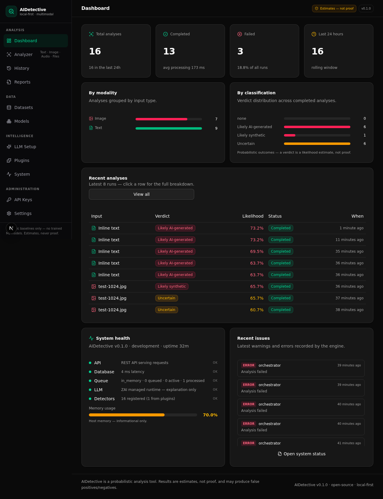

# AIDetective 🔍

**An open-source, local-first, multimodal AI-content detection platform.**

AIDetective analyzes **text, documents, images and audio** with an explainable, weighted ensemble of heuristic detectors. Every result ships with the raw signals, per-signal evidence, a likelihood score, a capped confidence value — and an honest disclaimer.

> ⚠️ **Read this first: AIDetective is probabilistic.** Its output is an *estimate*, never proof. Detection of AI-generated content can and does produce **false positives and false negatives**. `uncertain` and `inconclusive` are first-class outcomes in this project, and the scoring engine is **capped below 1.0 confidence by design**. Do not use AIDetective as sole evidence to accuse, punish, defame or judge anyone. See [docs/limitations.md](docs/limitations.md).

[](LICENSE)
[]()
[]()

---

## Contents

- [Screenshots](#screenshots)
- [What this is / What this is NOT](#what-this-is--what-this-is-not)
- [Features](#features)
- [Supported modalities & formats](#supported-modalities--formats)
- [Architecture](#architecture)
- [Built-in detectors](#built-in-detectors)
- [Tech stack & design adaptation](#tech-stack--design-adaptation)
- [Installation](#installation)
- [Production build & Docker](#production-build--docker)
- [API usage](#api-usage)
- [Python client](#python-client)
- [LLM setup](#llm-setup)
- [Plugin development](#plugin-development)
- [Detector development](#detector-development)
- [Project structure](#project-structure)
- [Testing](#testing)
- [Limitations](#limitations)
- [Roadmap](#roadmap)
- [Environment variables](#environment-variables)
- [Contributing](#contributing)
- [License](#license)

---

## Screenshots

> Screenshots captured from the local web dashboard (v0.1.0).




---

## What this is / What this is NOT

| ✅ What this **is** | ❌ What this is **NOT** |
| --- | --- |
| A local-first, self-hosted analysis workbench for AI-content suspicion signals | A court-proof authorship verifier or a forensic tool |
| A deterministic, explainable scoring engine over **heuristic baseline detectors** | A trained ML classifier (no models were trained in this release — the detectors are transparent heuristics) |
| A system that shows its work: every signal, value, weight and evidence quote is inspectable | A black box that returns a single "AI % with certainty" |
| A platform where `uncertain` / `inconclusive` are valid, expected answers | An oracle. Ambiguity is the honest answer for a lot of real-world content |
| A plugin platform (detectors, parsers, LLM providers, report exporters) | A substitute for provenance systems (C2PA, watermarks) — that's on the roadmap |
| An optional LLM layer that **explains** results in plain language | An LLM judge — the LLM can never change the verdict, by prompt-contract *and* by code |

**Detection is probabilistic.** Treat every classification (`likely_human`, `likely_ai_generated`, `likely_synthetic`) as a starting point for human review, never as the conclusion.

---

## Features

- **Four modalities**: text (inline or file), documents (PDF/DOCX), images (PNG/JPG/WEBP), audio (WAV/MP3/FLAC/M4A).
- **15 built-in heuristic detectors** with per-signal `aiScore` (0 = human … 1 = AI, 0.5 = neutral), weight, direction and quoted/statistical **evidence**.
- **Explainable scoring engine**: weighted vote → likelihood score; signal consistency & strength → confidence (hard-capped at 0.92 by default). Full per-signal contribution breakdown is persisted.
- **File analysis pipeline** with magic-byte type detection, filename sanitization, size limits and queued processing (202 + polling).
- **Reports**: structured JSON and self-contained printable HTML (JSON + HTML only in this release; PDF is a planned drop-in via the `ReportExporter` interface).
- **Optional LLM layer** (explanation only): ZAI managed runtime, Ollama, or any OpenAI-compatible API (OpenAI/OpenRouter/custom). Disabled by default.
- **Plugin system**: drop a folder under `plugins/`, and the loader registers your detectors/parsers/LLM providers/exporters at boot — broken plugins are contained and reported, never fatal.
- **REST API** (`/api/v1`) with a unified `{ok, data | error}` envelope, CORS, OpenAPI 3.0.3 description (18 paths), optional API-key auth with per-key rate limits (keys stored sha256-hashed, plaintext shown once).
- **Local-first storage**: SQLite via Prisma; uploaded files stored under server-generated ids inside the `uploads/` directory.
- **Persian + English awareness** in text features (language detection, phrase lists; Persian coverage is explicitly experimental).

---

## Supported modalities & formats

Type detection is based on **magic bytes** — the client-supplied filename and MIME type are treated as hints only.

| Input | Detected as | Pipeline | Analysis level |
| --- | --- | --- | --- |
| Inline text (`POST /api/v1/analyze`) | `text` | Full text feature extraction | **Full** — all 9 text detectors |
| `.txt` / `.md` (markdown lightly stripped) | `text` | Plain-text parser | **Full** — all 9 text detectors |
| `.pdf` | `document` | Text extraction via `unpdf` → text pipeline | **Full (text-level)** — image-only/scanned PDFs get an explicit warning; no OCR |
| `.docx` | `document` | Text extraction via `mammoth` → text pipeline | **Full (text-level)** |
| `.png` / `.jpg` / `.jpeg` | `image` | Metadata (EXIF/PNG chunks, JPEG quantization) + decoded pixel statistics (`sharp`) | **Heuristic baseline** — no trained computer-vision model in this release |
| `.webp` | `image` | Decoded pixel statistics | **Limited** — metadata parsing is limited for WEBP (a warning is attached) |
| `.wav` | `audio` | Container metadata **+ PCM waveform statistics** | **Full (audio-level)** — the only format with waveform analysis |
| `.mp3` / `.flac` / `.m4a` | `audio` | Container/tag metadata only (ID3v2, VORBIS comments, M4A `ilst`) | **Metadata-only** — waveform analysis is WAV-only in this release |

There is **no speech-to-text / transcript analysis** yet (no ASR, and no Persian ASR). See [Limitations](#limitations) and the [Roadmap](#roadmap).

---

## Architecture

```
                    ┌───────────────────────┐
                    │        User           │
                    └──────────┬────────────┘
                               │
                    ┌──────────▼────────────┐
                    │    Web Dashboard      │   (dark analyst workspace)
                    └──────────┬────────────┘
                               │
                    ┌──────────▼────────────┐
                    │   REST API /api/v1    │   auth (optional API keys) · CORS · {ok,data|error}
                    └──────────┬────────────┘
                               │
                    ┌──────────▼────────────┐
                    │ Analysis Orchestrator │   inline text path · queued file path (in-memory FIFO)
                    └──────────┬────────────┘
                               │
        ┌──────────────────────┼───────────────────────┐
        │                      │                       │
┌───────▼────────┐    ┌────────▼────────┐    ┌─────────▼────────┐
│ Text/Document  │    │  Image Pipeline │    │  Audio Pipeline  │   ← modality pipelines
│    Pipeline    │    │  (sharp, EXIF)  │    │ (WAV PCM decode) │     (parsers feed these)
└───────┬────────┘    └────────┬────────┘    └─────────┬────────┘
        │                      │                       │
        └──────────────┬───────┴───────────┬───────────┘
                       │                   │
            ┌──────────▼──────────┐  ┌─────▼─────────────┐
            │      Detectors      │  │    Evidence       │   15 builtins + plugins,
            │ (heuristic signals) │  │ (quotes, stats,   │  per-detector errors contained
            └──────────┬──────────┘  │  metadata)        │
                       └──────┬──────┴───────────────────┘
                              │
                   ┌──────────▼────────────┐
                   │    Scoring Engine     │  weighted vote → score
                   │ (deterministic)       │  consistency/strength → confidence (capped < 1.0)
                   └──────────┬────────────┘  thresholds · uncertain / inconclusive rules
                              │
                   ┌──────────▼────────────┐
                   │ Optional LLM (zai /   │  EXPLANATION ONLY — receives the structured
                   │ Ollama / OpenAI-comp.)│  verdict; can never change it
                   └──────────┬────────────┘
                              │
                   ┌──────────▼────────────┐
                   │    Report Engine      │  JSON + self-contained HTML (exporter plugins)
                   └──────────┬────────────┘
                              │
                   ┌──────────▼────────────┐
                   │   Database (Prisma +  │  analyses, signals, detector runs,
                   │   SQLite, local-first)│  reports, api keys, plugins, events, settings
                   └───────────────────────┘
```

A deeper write-up (orchestrator flow, scoring math, queue design, security model) is in [docs/architecture.md](docs/architecture.md).

---

## Built-in detectors

All detectors are **transparent heuristics** (no trained models). Each exposes its own honest `limitations` — also visible at `GET /api/v1/detectors`. Weights are relative within a modality and configurable at runtime.

| Detector id | Modality | What it measures | Weight |
| --- | --- | --- | --- |
| `text.burstiness` | text, document | Variability of sentence lengths (coefficient of variation). Flat rhythm leans AI; bursty rhythm leans human | 0.80 |
| `text.phrases` | text, document | Density of phrases over-represented in LLM output ("delve into", "plays a crucial role", …; English lists full, Persian lists experimental). Matches are quoted as evidence | 0.85 |
| `text.structure` | text, document | Structural "tidiness": uniform paragraph sizes, every sentence capitalized & perfectly terminated, list-like scaffolding | 0.60 |
| `text.vocabulary` | text, document | Lexical richness: root TTR, hapax legomena share, normalized entropy | 0.55 |
| `text.informality` | text, document | Human-tell markers: contractions, informal vocabulary (lol, btw), emoji, letter elongation, ALL-CAPS | 0.55 |
| `text.repetition` | text, document | Repeated exact 4-word sequences (generation artifacts, duplication) | 0.50 |
| `text.punctuation` | text, document | Punctuation habits: !/? usage, em-dash density, ellipses, repeated punctuation, comma regularity | 0.50 |
| `text.connectives` | text, document | Density of formal connectives (however, moreover, furthermore…) | 0.50 |
| `text.lexical_entropy` | text, document | Shannon entropy of the word-frequency distribution, normalized to [0,1] | 0.40 |
| `image.metadata` | image | EXIF/PNG provenance: generative-AI tool tags, camera capture metadata, editor software, C2PA content-credential markers | 0.90 |
| `audio.metadata` | audio | Container/tag metadata (ID3v2, VORBIS, M4A `ilst`, WAV `LIST/INFO`): encoder software and known TTS/speech-synthesis tools | 0.90 |
| `image.dimensions` | image | Dimension profile: canvases typical of diffusion models (multiples of 64) vs camera sensor sizes | 0.45 |
| `audio.waveform` | audio *(WAV only, experimental)* | PCM dynamics: RMS variability across 50 ms windows, silence ratio & pause structure, clipping, DC offset, zero-crossing rate | 0.40 |
| `image.pixel_stats` | image *(experimental)* | First-order pixel statistics: high-frequency energy (Laplacian variance), LSB uniformity, channel balance | 0.30 |
| `image.compression` | image | Compression profile: JPEG quantization-table quality estimate + chroma subsampling, or PNG color/bit-depth profile (mostly descriptive) | 0.25 |

**Example plugin:** [`plugins/example-text-detector/`](plugins/example-text-detector/) registers `text.example.hedging` (weight 0.35) — a real, deterministic detector that counts hedging/SEO openings ("In this article, we will…", "Let's dive in…") and quotes each occurrence as evidence. It doubles as the reference implementation of the plugin contract.

---

## Tech stack & design adaptation

- **Next.js 16 (App Router) + TypeScript** — API route handlers under `src/app/api/v1/**` are the REST layer.
- **Prisma 6 + SQLite** — local-first persistence (schema avoids SQLite-specific features to keep a PostgreSQL migration open).
- **Tailwind CSS 4 + shadcn/ui** — dark analyst workspace UI (sidebar navigation, 11+ views).
- **sharp** (pixel statistics), **exifreader** (image metadata), **unpdf** (PDF text), **mammoth** (DOCX text).
- **Bun** as package manager & runtime; `z-ai-web-dev-sdk` only for the optional managed LLM provider.

> **Adaptation note (honest):** the original project brief specified a **Python + FastAPI** backend. The implemented backend is **TypeScript on Next.js 16**. What changed: FastAPI routers → Next.js App Router route handlers; Pydantic models → zod + TypeScript interfaces (`src/lib/aidetective/core/types.ts`); a worker queue → an in-process FIFO (`src/lib/aidetective/queue/job-queue.ts`, Redis planned); SQLAlchemy/PostgreSQL → Prisma/SQLite for the local-first default. What did **not** change: the REST contract (paths, unified envelope, OpenAPI 3.0.3 spec, key auth), the detector/analyzer/parser pipeline design, and the scoring engine's deterministic, explainable behavior. The API is framework-agnostic — any HTTP client works.

---

## Installation

Requirements: **[Bun](https://bun.sh)** 1.1+ (Node 20+ works for serving, but scripts assume Bun), ~500 MB disk.

```bash
git clone https://github.com/<org>/aidetective.git
cd aidetective
bun install
cp .env.example .env       # defaults are safe: LLM disabled, local mode
bun run db:push            # creates the SQLite schema
bun run dev                # http://localhost:3000
```

Open `http://localhost:3000`. In this release, use the REST API (below) or the OpenAPI document at `http://localhost:3000/api/v1/openapi` to explore. On first request the engine bootstraps itself: builtin detectors/parsers/exporters → plugins → queue worker → model-registry seeding.

Useful scripts: `bun run lint`, `bun run db:generate`, `bun run db:push`, `bun run build`, `bun run start`.

---

## Production build & Docker

**Local production build** (devDependencies are required to build):

```bash
bun install
bun run build
bun run start
```

> Note: `next.config.ts` in this release does **not** enable Next.js `output: "standalone"`, so serve with `bunx next start` (the bundled `bun run start` script expects a standalone build). The Docker image below already does the right thing.

**Docker** (recommended):

```bash
cp .env.example .env
# in .env, set: DATABASE_URL=file:/app/db/custom.db  (so the DB lands in the mounted ./db volume)
docker compose up -d --build
# → http://localhost:3000
```

The image is a three-stage build on `oven/bun:1` (deps → build → runtime). At container start it runs `bun run db:push` (idempotent schema sync) and then `bunx next start -p 3000`. Mount `./db` and `./uploads` (docker-compose.yml does this) so the SQLite file and uploaded files survive container replacement.

---

## API usage

Base URL: `http://localhost:3000`. All responses use the envelope `{"ok": true, "data": …}` or `{"ok": false, "error": {"code", "message", "details?"}}`. CORS is enabled; auth is optional in local mode (see [API keys](#api-keys)).

**OpenAPI:** `GET /api/v1/openapi` returns a complete **OpenAPI 3.0.3** description (18 paths). Import that URL directly into Swagger UI, Postman, Insomnia or Redoc.

### Analyze inline text

```bash
curl -s http://localhost:3000/api/v1/analyze \
  -H "Content-Type: application/json" \
  -d '{
        "content": "In today'"'"'s fast-paced world, it is important to delve into the crucial role of technology. Furthermore, it is worth noting that…",
        "options": { "useLlm": false }
      }'
# → data.classification, data.likelihoodScore, data.confidence, data.signals[], data.detectorRuns[]
```

### Analyze an uploaded file (multipart → 202 → poll)

```bash
curl -s -X POST http://localhost:3000/api/v1/analyze/file \
  -F "file=@./sample.pdf" \
  -F 'options={"useLlm":true}'
# → 202 Accepted with a queued analysis; then poll:
curl -s http://localhost:3000/api/v1/analyses/<id>      # until status: completed | failed
```

### List / search analyses

```bash
curl -s "http://localhost:3000/api/v1/analyses?modality=image&status=completed&sort=createdAt&order=desc&page=1&pageSize=20"
```

Query params: `query, modality, classification, status, from, to, sort (createdAt|likelihoodScore|confidence|processingTime), order, page, pageSize (≤100)`.

### Get a report (JSON or HTML)

```bash
curl -s "http://localhost:3000/api/v1/reports/<id>?format=json" | jq
curl -s "http://localhost:3000/api/v1/reports/<id>?format=html" -o report.html   # self-contained, printable
```

Both embed software/version info and a prominent disclaimer. Reports are generated only for `completed` analyses (409 otherwise). JSON + HTML only in this release (PDF is on the roadmap as a drop-in exporter).

### API keys

Auth is **optional local-mode** by default (`AIDETECTIVE_REQUIRE_API_KEY=false`): requests without a key are accepted from local clients; if a key is provided it is validated. Enable enforcement for shared/remote deployments.

```bash
# Create a key (plaintext shown ONCE — only its sha256 is stored)
curl -s -X POST http://localhost:3000/api/v1/api-keys \
  -H "Content-Type: application/json" \
  -d '{"name": "my-client", "rateLimit": 60}'
# → {"ok":true,"data":{"key":"adk_5f3c…","prefix":"adk_5f3c…","…"}}

# Use it (Bearer or X-API-Key)
curl -s http://localhost:3000/api/v1/analyses \
  -H "Authorization: Bearer adk_5f3c…"

# Revoke later
curl -s -X DELETE http://localhost:3000/api/v1/api-keys/<keyId>
```

### Other endpoints

`GET /system/status` · `GET /stats` · `GET /detectors` · `GET|POST /models`, `PATCH|DELETE /models/{id}` · `GET /plugins` · `GET|POST /datasets`, `GET|DELETE /datasets/{id}`, `POST /datasets/{id}/samples` (text import only) · `POST /llm/test` · `GET|PUT /settings` · `DELETE /analyses/{id}`. Full details: [`/api/v1/openapi`](http://localhost:3000/api/v1/openapi).

---

## Python client

A dependency-free (only `requests`) example client lives at **[`examples/aidetective_client.py`](examples/aidetective_client.py)**. It analyzes text or a file, polls queued file analyses, and prints the classification, likelihood score, confidence and the top signals — always followed by the "not proof" disclaimer.

```bash
pip install requests
export AIDETECTIVE_URL=http://localhost:3000
export AIDETECTIVE_API_KEY=adk_...        # optional (only if enforcement is on)

python examples/aidetective_client.py text "In today's fast-paced world, it is crucial to note that…"
python examples/aidetective_client.py file ./sample.pdf
```

---

## LLM setup

The LLM layer is **optional and explanation-only**. The verdict, score and confidence come exclusively from the deterministic scoring engine. The interpretation receives only the structured result (classification, score, confidence, up to 20 compacted signals, key evidence quotes) and its system prompt forbids changing, re-computing or confirming the verdict. If the LLM call fails, the analysis completes normally and a warning is attached. Configure via environment variables **and/or** runtime settings (`GET/PUT /api/v1/settings`; the dashboard LLM/Settings pages provide the same controls). A request only triggers an interpretation when LLM support is enabled **and** `options.useLlm: true` is sent. `POST /api/v1/llm/test` verifies connectivity.

| Provider | `AIDETECTIVE_LLM_PROVIDER` | Required env | Notes |
| --- | --- | --- | --- |
| **ZAI managed runtime** | `zai` | none | Works without user-side keys (used in managed sandboxes); model `glm-4.5-flash` |
| **Ollama (local)** | `ollama` | `AIDETECTIVE_LLM_BASE_URL` (e.g. `http://localhost:11434`) | Default model `llama3.1` (`AIDETECTIVE_LLM_MODEL` to override); fully offline |
| **OpenAI-compatible** | `openai_compatible` | `AIDETECTIVE_LLM_BASE_URL` (e.g. `https://api.openai.com/v1`, `https://openrouter.ai/api/v1`) | Optional `AIDETECTIVE_LLM_API_KEY` (Bearer); default model `gpt-4o-mini` |

```bash
# Example: local Ollama
AIDETECTIVE_LLM_ENABLED=true
AIDETECTIVE_LLM_PROVIDER=ollama
AIDETECTIVE_LLM_BASE_URL=http://localhost:11434
AIDETECTIVE_LLM_MODEL=llama3.1

# Example: OpenRouter
AIDETECTIVE_LLM_ENABLED=true
AIDETECTIVE_LLM_PROVIDER=openai_compatible
AIDETECTIVE_LLM_BASE_URL=https://openrouter.ai/api/v1
AIDETECTIVE_LLM_MODEL=meta-llama/llama-3.1-8b-instruct
AIDETECTIVE_LLM_API_KEY=sk-or-...

# Verify:
curl -s -X POST http://localhost:3000/api/v1/llm/test
```

The interpretation is stored on the analysis (`llmInterpretation`, `llmProvider`, `llmModel`) and appears in reports — clearly separated from the engine's signals.

---

## Plugin development

Full guide with runnable code: **[docs/plugins.md](docs/plugins.md)**. Contract summary:

```
plugins/<my-plugin>/
├── plugin.json   # manifest: { id, name, version, type, modality?, entry, description? }
└── index.js      # ESM, must export: register(api)
```

`type` ∈ `detector | parser | llm_provider | exporter`. The loader scans `plugins/` at boot (fixed root, no traversal), validates manifests, dynamic-imports the entry at runtime (never bundled, never `eval`ed) and calls `register(api)` with:

```js
api.registerDetector(detector)      // Detector object (see below)
api.registerParser(parser)          // FileParser — new input formats
api.registerLLMProvider(provider)   // registered for visibility; the active provider is resolved via settings (no silent hijack)
api.registerExporter(exporter)      // ReportExporter — e.g. a future PDF exporter
```

Every registration is validated; a throwing plugin is recorded with status `error` (visible at `GET /api/v1/plugins` and in the DB) and **cannot crash the app**. Restart to reload plugins. Start from [`plugins/example-text-detector/`](plugins/example-text-detector/).

---

## Detector development

A detector is a plain object implementing the `Detector` interface from [`src/lib/aidetective/core/types.ts`](src/lib/aidetective/core/types.ts):

```ts
interface Detector {
  id: string;                    // e.g. "text.my-detector" (namespaced by modality)
  name: string;
  version: string;               // bump when behavior changes — stored per run
  description: string;
  modalities: Modality[];        // "text" | "image" | "audio" | "document"
  defaultWeight: number;         // 0..1, relative importance inside the modality
  limitations: string[];         // honest, user-visible — mandatory
  analyze(ctx: DetectorContext): Promise<{
    status: "ok" | "skipped" | "error";
    signals: Signal[];
    summary?: string;
    error?: string;
  }>;
}

interface Signal {
  id: string;                    // e.g. `${detectorId}.low_variance`
  detectorId: string;
  name: string;
  value?: number | string | boolean | null;
  unit?: string;
  aiScore: number | null;        // 0 = strongly human, 0.5 = neutral, 1 = strongly AI; null = not quantifiable
  weight: number;
  evidence: EvidenceItem[];      // quotes / statistics / metadata / observations
  notes?: string;
}
```

`ctx` provides `input` (text or buffer + metadata), `modality`, pre-extracted `features` and `options`. Rules of the house:

- **Always fill `limitations`** — detectors that hide their weaknesses are rejected in review.
- Return `status: "skipped"` when the input can't support the measurement (e.g. too few sentences); return `aiScore: null` for descriptive-but-unquantifiable findings.
- A thrown error never aborts the analysis — it is recorded per detector and surfaced as a warning.
- The scoring engine clamps weights to [0, 1] and lets users override weights per detector id via settings.

---

## Project structure

```
├── prisma/
│   └── schema.prisma                 # Analysis, AnalysisSignal, AnalysisDetectorRun, Report,
│                                     # ApiKey, Dataset, Model, Plugin, SystemEvent, Setting
├── plugins/
│   └── example-text-detector/        # reference plugin (plugin.json + index.js)
├── docs/
│   ├── architecture.md               # deep dive: orchestrator, scoring math, queue, security
│   ├── plugins.md                    # plugin author guide + full examples
│   └── limitations.md                # honest limitations & responsible-use guidance
├── examples/
│   └── aidetective_client.py         # Python REST client (requests only)
├── src/
│   ├── app/
│   │   ├── page.tsx                  # single-route dashboard workspace
│   │   └── api/v1/                   # REST API (18 paths, OpenAPI 3.0.3)
│   │       ├── analyze/              # POST inline text
│   │       ├── analyze/file/         # POST multipart (202 + poll)
│   │       ├── analyses/             # GET list/search · GET|DELETE /analyses/[id]
│   │       ├── reports/[id]/         # GET ?format=json|html
│   │       ├── system/status/ · stats/ · detectors/
│   │       ├── models/ · models/[id]/ · plugins/ · datasets/… · llm/test/
│   │       ├── settings/ · api-keys/ · api-keys/[id]/
│   │       └── openapi/              # OpenAPI 3.0.3 document
│   ├── components/
│   │   ├── aidetective/views/        # dashboard views (dashboard, analyzer, history, reports, datasets, models, llm, api, plugins, system, settings)
│   │   └── ui/                       # shadcn/ui primitives
│   ├── lib/
│   │   ├── api/respond.ts            # envelope {ok, data|error}, CORS, auth wrapper
│   │   ├── db.ts                     # Prisma client
│   │   └── aidetective/
│   │       ├── core/                 # types, scoring, registry, config, logger, errors
│   │       ├── features/             # text / image / audio feature extractors
│   │       ├── parsers/              # txt·md, pdf, docx, image passthrough, audio passthrough
│   │       ├── detectors/
│   │       │   ├── text/             # 9 detectors
│   │       │   ├── image/            # 4 detectors
│   │       │   ├── audio/            # 2 detectors
│   │       │   └── register.ts
│   │       ├── analyzers/            # per-modality pipelines
│   │       ├── orchestrator.ts       # inline + queued analysis pipeline
│   │       ├── llm/                  # providers (zai, ollama, openai-compatible) + interpreter
│   │       ├── reports/              # JSON + HTML exporters
│   │       ├── plugins/              # loader (fs scan + runtime dynamic import)
│   │       ├── services/             # analysis-store, settings, system
│   │       ├── queue/                # in-memory FIFO job queue (Redis planned)
│   │       ├── security/             # magic-byte file validation, API-key auth
│   │       └── bootstrap.ts          # builtins → plugins → queue → model seeding
│   └── hooks/                        # UI helpers
├── Dockerfile · docker-compose.yml · .dockerignore
├── .env.example · LICENSE (MIT) · README.md · README.fa.md
└── worklog.md                        # agent work journal
```

---

## Testing

**Honest status: this release ships without an automated test suite.** The project was built and verified in a constrained sandbox environment (end-to-end behavior was verified manually via `curl` — see `worklog.md`), and there was no room to land a proper suite. This is a known gap, it is tracked as the first phase-2 item, and the matrix below is the contract for it. We'd rather ship a documented gap than a fake ✅.

Intended test matrix:

| Area | Coverage |
| --- | --- |
| API tests | envelope shape; CORS; auth (local mode vs enforcement, invalid/revoked keys, rate limits); validation errors (empty text, oversize upload, unsupported type); 202 + polling flow; OpenAPI doc validity |
| Detector unit tests | each of the 15 detectors on synthetic fixtures (AI-ish vs human-ish text; EXIF-tagged vs clean images; TTS-tagged WAVs); `skipped`/`error` states; `limitations` present |
| Parser tests | txt/md stripping; PDF extraction incl. scanned-PDF warning; DOCX extraction; magic-byte detection vs lying extensions/MIME |
| Scoring tests | deterministic math (weighted vote, polarity, consistency, strength, confidence cap); uncertain/inconclusive rules; threshold boundaries; per-detector weight overrides |
| Auth tests | sha256-at-rest, plaintext-shown-once, per-key sliding-window rate limit, local-mode default |
| File-validation tests | size limits, filename sanitization, storage-path containment (`isInsideUploads`), declared-vs-detected type warnings |
| Plugin registration tests | manifest validation, entry-path rules, broken-plugin containment, duplicate ids, DB status persistence |

Suggested tooling: **vitest** or **bun test** for units + scoring; route handlers invoked directly (or `fetch` against a test server) for API tests; small binary fixtures under `tests/fixtures/`. The detector interfaces are pure and synchronous-friendly, so unit tests need no HTTP layer.

---

## Limitations

Full, maintained list: **[docs/limitations.md](docs/limitations.md)**. Summary (all of these are also surfaced as warnings by the API/UI):

- **No trained ML models.** All 15 detectors are heuristic baselines. Accuracy is unknown-by-benchmark; do not assume published AUC figures apply.
- **Detection is probabilistic and dual-sided**: false positives (human work flagged as AI) and false negatives (AI work flagged as human) both occur. Short texts (< ~120 words) are explicitly flagged as unreliable.
- **Audio**: waveform analysis is **WAV-only**; MP3/FLAC/M4A are metadata-only; **no ASR/transcript analysis**, no Persian ASR.
- **Images**: no trained computer-vision model; WEBP metadata parsing is limited; no GPU detection.
- **Datasets**: text-only import/export (no image/audio datasets yet); no evaluation harness yet.
- **Reports**: JSON and self-contained HTML only (no PDF exporter yet).
- **Queue**: in-memory FIFO — no persistence across restarts, no distributed workers.
- **LLM layer** is optional and explanation-only; it never decides verdicts (and cannot).
- **Auth** is optional local-mode by default — enable `AIDETECTIVE_REQUIRE_API_KEY` for any shared deployment.
- **No automated test suite** in this release (see [Testing](#testing)).
- **Web dashboard** is under active development; this release is API-first.

> ⚠️ **Responsible use:** AIDetective provides a probabilistic analysis — its output is **not proof** of authorship or origin. Do not use it for legal accusations, disciplinary action, defamation, or harassment. Humans are routinely misclassified; treat results as one input among several, and always involve human review.

---

## Roadmap

**Phase 2 — correctness & scale**

- Automated test suite implementing the matrix above (vitest/bun test + fixtures).
- Trained computer-vision and audio models, distributed **through the existing plugin registry** (a model is just a detector plugin with higher weight + documented eval results).
- Redis-backed queue with persisted jobs and horizontal workers.
- PostgreSQL support (schema is already portable).
- Dataset evaluation harness: run detector sets against labeled datasets, publish per-detector ROC/precision-recall honestly.
- ASR transcript pipeline (incl. Persian ASR) feeding the text detectors.

**Phase 3 — platform**

- PDF report exporter (drop-in via `ReportExporter`).
- C2PA content-credentials verification integration.
- Web dashboard completion (analysis views, reports, settings, plugin manager).
- Weight auto-tuning from evaluated datasets; per-locale detector packs.
- Multi-user workspaces + SSO (currently single-tenant, local-first by design).

---

## Environment variables

All variables are read at boot by [`src/lib/aidetective/core/config.ts`](src/lib/aidetective/core/config.ts). See [`.env.example`](.env.example) for a commented template.

| Variable | Default | Purpose |
| --- | --- | --- |
| `DATABASE_URL` | `file:./db/custom.db` | SQLite connection (local-first). Relative paths resolve against `prisma/schema.prisma`; use an absolute path in Docker (`file:/app/db/custom.db`) |
| `AIDETECTIVE_REQUIRE_API_KEY` | `false` | Require API keys on `/api/v1` (local dashboard mode works without) |
| `AIDETECTIVE_MAX_UPLOAD_MB` | `25` | Upload size limit in MB (60 MB HTTP hard cap) |
| `AIDETECTIVE_MAX_TEXT_CHARS` | `200000` | Inline text length limit |
| `AIDETECTIVE_LLM_ENABLED` | `false` | Enable the optional (explanation-only) LLM layer |
| `AIDETECTIVE_LLM_PROVIDER` | `zai` | `zai` \| `ollama` \| `openai_compatible` |
| `AIDETECTIVE_LLM_BASE_URL` | — | Required for `ollama` / `openai_compatible` |
| `AIDETECTIVE_LLM_MODEL` | provider default | e.g. `llama3.1`, `gpt-4o-mini` |
| `AIDETECTIVE_LLM_API_KEY` | — | Bearer key for `openai_compatible` |
| `AIDETECTIVE_LLM_TEMPERATURE` | `0.2` | Generation temperature |
| `AIDETECTIVE_LLM_TIMEOUT_MS` | `25000` | LLM call timeout |
| `AIDETECTIVE_QUEUE_CONCURRENCY` | `1` | In-memory FIFO worker count |
| `AIDETECTIVE_UPLOADS_DIR` | `uploads` | Upload storage directory (server-generated filenames) |
| `LOG_LEVEL` | `info` | `debug` \| `info` \| `warn` \| `error` (structured, redacted) |
| `AIDETECTIVE_DEBUG_CONTENT` | `false` | Log raw user content — debug only, never in production |
| `AIDETECTIVE_SCORING_AI_THRESHOLD` | `0.62` | Score ≥ threshold → `likely_ai_generated` / `likely_synthetic` |
| `AIDETECTIVE_SCORING_HUMAN_THRESHOLD` | `0.42` | Score ≤ threshold → `likely_human` |
| `AIDETECTIVE_SCORING_MIN_SIGNALS` | `2` | Fewer usable signals → `uncertain` |
| `AIDETECTIVE_SCORING_MAX_CONFIDENCE` | `0.92` | Hard confidence cap (always < 1.0 by design) |

---

## Contributing

Contributions are welcome — especially **new detectors** (with honest `limitations`), parsers, exporters and evaluation datasets.

1. Read [docs/architecture.md](docs/architecture.md) and [docs/plugins.md](docs/plugins.md).
2. Small PRs beat big ones; keep the detector contract (`core/types.ts`) stable.
3. Every detector must document its limitations and failure modes — no exceptions.
4. Don't invent certainty: keep `uncertain`/`inconclusive` behavior intact, and keep the confidence cap.
5. Open an issue before large refactors. Run `bun run lint` before submitting.

---

## License

[MIT](LICENSE) © AIDetective contributors.

---

> **Final reminder:** AIDetective provides a probabilistic analysis of AI-content suspicion signals. It is **not proof**. False positives and false negatives are expected. Use it to inform human judgment — never to replace it.
